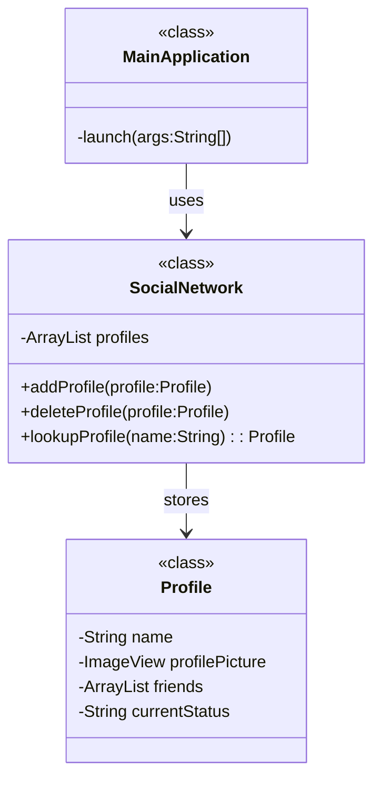
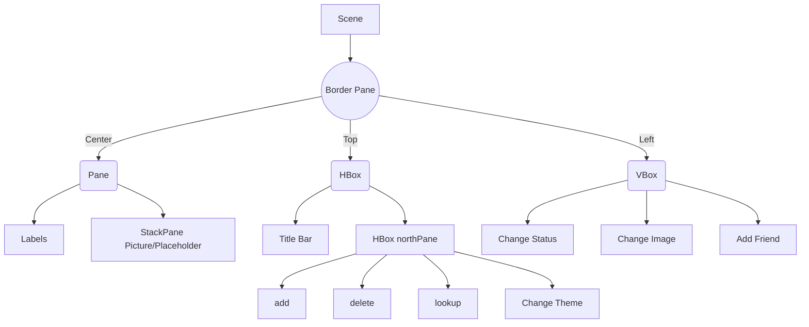

# FaceLite

## Table of Contents

- [Description](#description)
- [Technologies Used](#technologies-used)
- [Design Overview](#design-overview)
- [Usage](#usage)
- [Developers](#developers)

## Description

FaceLite is a social networking application that allows users to create profiles, connect with friends, and share updates. The application provides features such as adding friends, changing status messages, and updating profile pictures.

## Technologies Used

- **Java**: The programming language selected for this project, renowned for its reliability and versatility.
- **JavaFX**: The framework of choice for creating a dynamic and responsive user interface.
- **CSS**: Leveraged to refine and define the visual elements of the user interface, ensuring a cohesive aesthetic.
- **IntelliJ IDEA**: Our chosen IDE, offering a suite of development tools for coding, debugging, and progressive code enhancement.
- **Git**: The version control system we employ to track and manage changes to the codebase.
- **GitHub**: Our collaborative repository platform, facilitating code sharing and team contributions.

## Design Overview



### SocialNetwork.java

The SocialNetwork class represents the database. It contains an ArrayList of Profile objects, which represents the user profiles in the network. The class provides methods to get the profiles and perform operations such as adding friends as well as loading them from a file

#### Overview:
```java
private ArrayList<Profile> profiles;

public SocialNetwork()

public void addProfile(Profile profile)

public void deleteProfile(String name) 

public void addFriend(String name1, String name2)
   
public void load(File profiles) throws FileNotFoundException

public ArrayList<Profile> getFriendsProfiles(String[] names) 
```

### Profile.java

The Profile class represents a user profile. It has its properties: the name, profile picture location, profile picture, current status, and ArrayList of friends. The class also includes methods to retrieve and modify these properties.

#### Overview:
```java
private String name;
private String profilePictureLocation
private ImageView profilePicture
private ArrayList<Profile> friends
private String currentStatus

public Profile(String name)

public void addFriend(Profile friend)
```

### MainApplication.java

The Main Application class is the main class that extends the Application class from JavaFX. It provides the user interface for the FaceLite application. The class includes various components such as buttons, text fields, labels, and image views to interact with the user. It also handles events and actions related to adding friends, changing status, and updating profile pictures.

#### Overview
- **User Interface Elements**: The class contains UI elements like labels, text fields, buttons, and an image view for displaying profile pictures.
- **Profile and Friend Management**: Users can add, delete, set as a friend and look up profiles within the social network
- **Status and Picture Changes**: Users can update their status and change their profile picture, with immediate reflection in the UI.
- **Theme Management**: The application supports theme changes between 'White' and 'Dark' themes.
- **Data Persistence**: The application can store user profile data to a file upon closing.

#### Event Handling

The application makes extensive use of inner classes to handle events such as adding or deleting profiles, changing status or pictures, adding friends, and changing the theme. These event handlers follow the `EventHandler<ActionEvent>` interface pattern.

#### Layout and Styling

The UI is arranged using a `BorderPane` with dedicated panes for different sections of the application (north, west, and center). Styling is applied using CSS and programmatically adding style classes to nodes.



## Usage

To use the FaceLite application, follow these steps:

1. Ensure you have Java and JavaFX installed on your system.
2. Clone the repository to your local machine.
3. Open the project in your preferred Java development environment.
4. Build and run the project.
5. The FaceLite application window will appear.
6. Use the provided text fields and buttons to add friends, change status, and update profile pictures.
7. Explore the different features and functionalities of the application.

## Additinoal features
- Modern LogIn page (not completed yet)
- Saving users data in the system when closing the application
- Modern dark the for eye comfort


## Developers

- Hussain Albaqqal 202253340
- Hasan Almualim 202245200

*Thank you for your interest in FaceLite project!*
